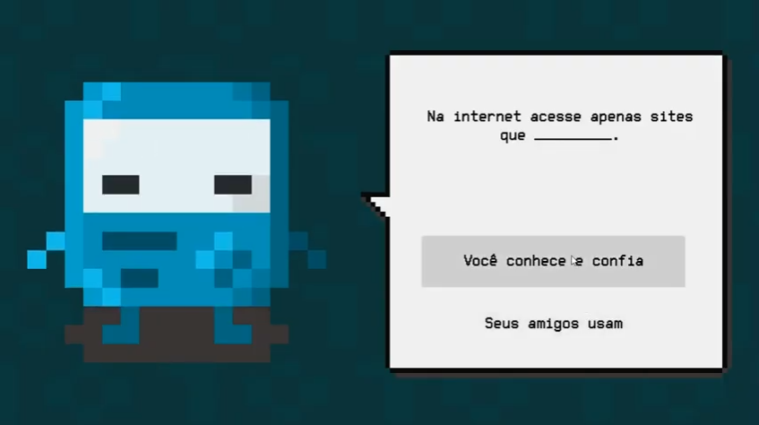

# Bit no mundo digital
Files for my graduation project made in Unity for UDESC (Universidade do Estado de Santa Catatina).

The game is a platformer/quiz made to show kids some concepts of information security and internet security in general.

I used the CharacterController2D script from Brackeys 2D Character Controller project witch can be found [here](https://github.com/Brackeys/2D-Character-Controller).

A short demonstration video of the game on youtube can be watched [here](https://www.youtube.com/watch?v=rkTbRhIgQ-A)

Screenshots
-------------

        
